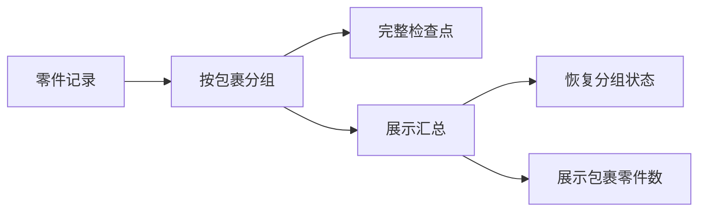

# ParcelDesk 数据流

数据按读取、分组、保存或使用的顺序流动：

```mermaid
flowchart LR
    Parts[零件记录] --> Grouped[按包裹分组]
    Grouped --> Checkpoint[完整检查点]
    Grouped --> Totals[展示汇总]
    Totals --> Restore[恢复分组状态]
    Totals --> Display[展示包裹零件数]
```

`save_checkpoint()` 和 `write_totals()` 均接受已经分组的对象。两份输出用于不同的
后续操作，读取方应取得适合其任务的材料。已有检查点可以直接交给恢复接口，无需
重新提供原始 CSV。单纯展示包裹的零件数时可以只使用汇总。
